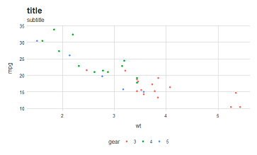
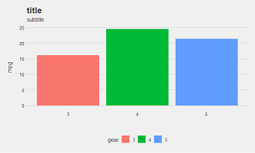
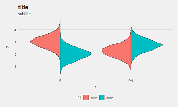

# ggunchained

This is an extension for ggplot2 in a very early stage of development.
The inital goal is to find out, whether a package like this could be useful for us.


### What it does
##### ggplot2 themes
theme_janco_point(), 




theme_janco_bar()




##### Split violin function 
geom_split_violin()




### How to install
```r
library(devtools)
install_github("JanCoUnchained/ggunchained")
```
